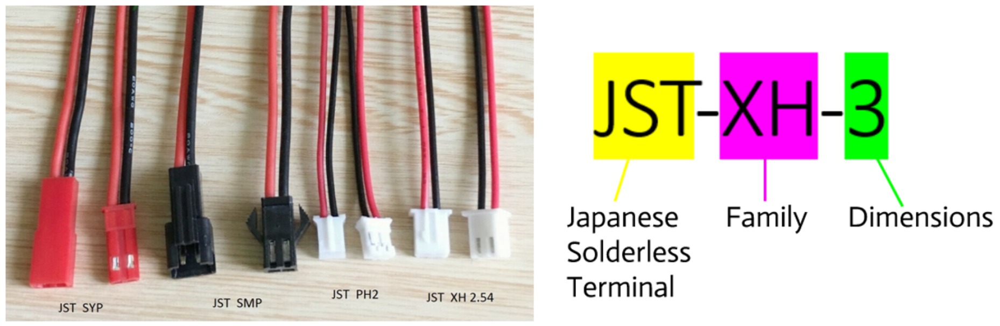
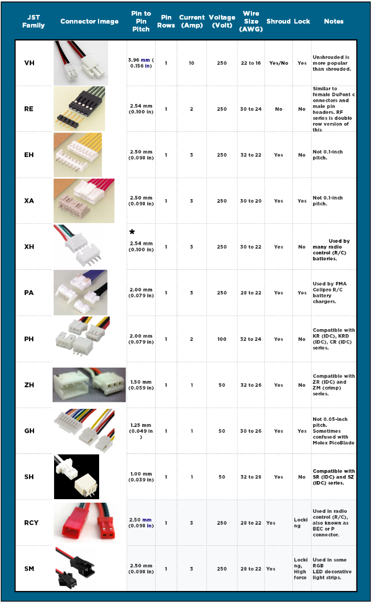

# How to distinguish different types of JST connectors?

- First, decide the type of JST connectors
- Second, size: measure the distance between two pins of the JST connectors

"JST connectors are mostly identified by the length between one contanct to the centre of another contact. There are always between two to higher contacts in a single line. Some families have multiple rows as well. This length is the pitch of the connector type and determines the family that the connector is a part off. For example connector in the family 'PH' all have a 2.00mm pitch. When identifying what particular connector you have determine this pitch value first. Next, you need to determine the shape and size of the housing. See below for an expansive table with images and general application of all families of this connector type. Note here the * in reference to the XH-JST Connectors, some manufacturers will use 2.54 and 2.5mm pitch interchangeably with connectors with less than 4 pins. Know however the JST standard is to always use the metric system." -- contents from the link below.

Note: the figures are used from the link below.

For more details, see: https://core-electronics.com.au/guides/identify-electrical-connectors/#:~:text=JST%20connectors%20are%20mostly%20identified,connector%20is%20a%20part%20off.

